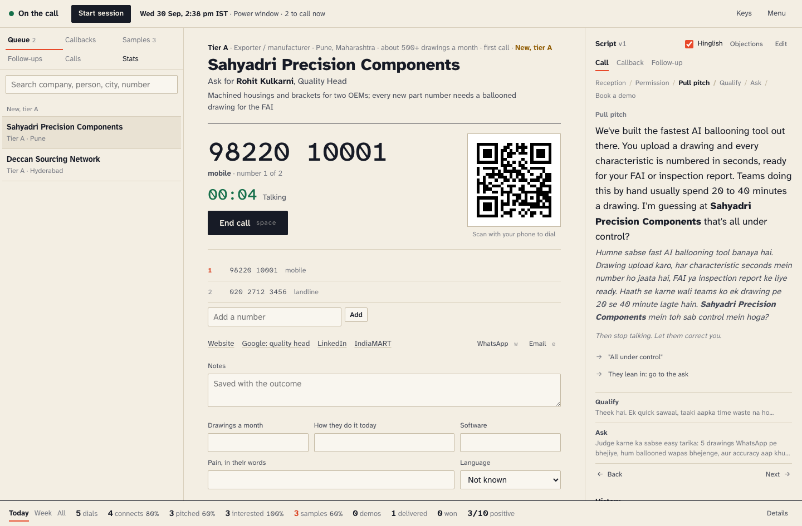
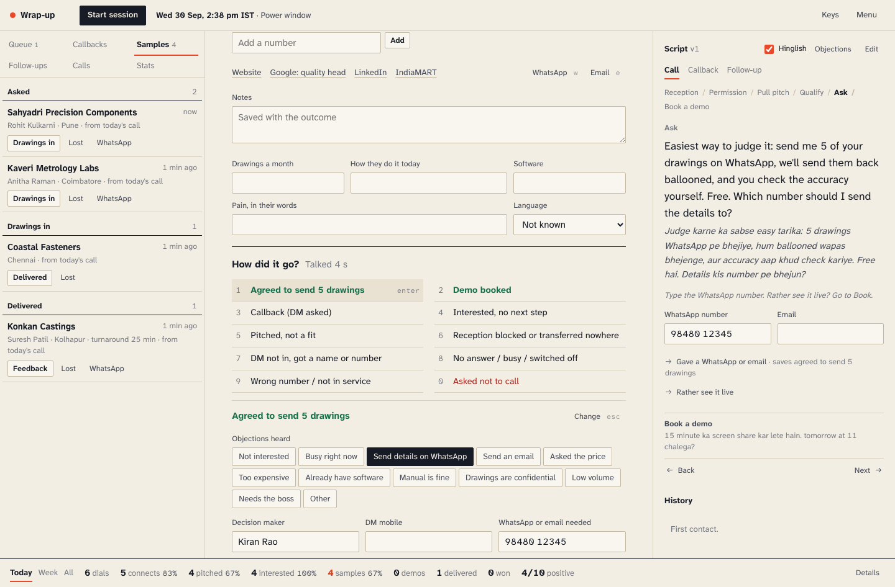
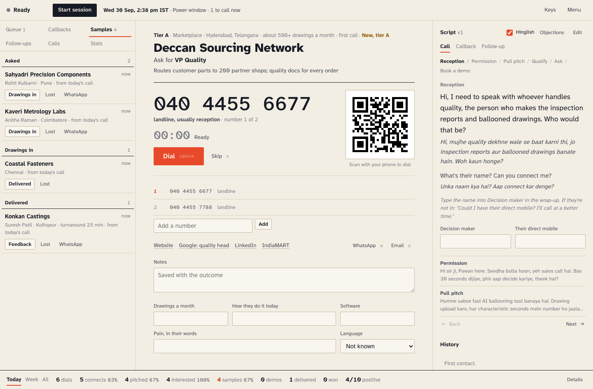

# India dialer

A manual power dialer for the India ballooning calls. You dial on your own
mobile. The laptop does everything else: the queue, a one-tap hand-off to
the phone, the timer, the script, the wrap-up, follow-ups and the numbers.

There is no Twilio, Telnyx or any other carrier here, no call recording, and
nothing is ever sent on its own. It is separate from `dialer/`, which it does
not touch.



## Setup

Python 3.9 or newer. PyYAML is required. `phonenumbers` is optional but
recommended, because it tells Indian mobiles from landlines exactly:

```bash
python3 -m venv .venv && .venv/bin/pip install -r india-dialer/requirements.txt
```

The scripts switch to `.venv` by themselves when it exists, so after that
the plain `python3` commands below work.

Put the list in `Me/` at the repo root. `Me/` and `india-dialer/data/` are in
`.gitignore`: the list has people's mobile numbers and the repo is public.

```bash
python3 india-dialer/import.py Me/India-Ballooning-Call-List_100_2026-09-28.csv
python3 india-dialer/serve.py
```

The import prints counts by tier and by phone type, and lists the leads
with more than one number, the held leads, the international-only leads
and the leads with no number. Re-importing is safe: new companies are
added, untouched ones pick up new fields, and anything already dialled
keeps its history. `--dry-run` parses and reports without writing.

`serve.py` opens the cockpit at http://localhost:8780.

| Flag | What it does |
|---|---|
| `--port 8780` | Pick the port. |
| `--no-open` | Don't open a browser. |
| `--demo` | Load 9 sample companies into an empty database, to try it out. |
| `--lan` | Also serve the phone page `/m` on your Wi-Fi (see below). |

Data lives in `india-dialer/data/india.db` (SQLite). Set `INDIA_DATA_DIR` to
keep it elsewhere. Back that folder up; it is the only copy of your calls.

**Rehearsal clock.** `INDIA_CLOCK_SHIFT_MIN=120 python3 india-dialer/serve.py`
moves the app's clock two hours, so you can try the power windows at
lunchtime or in the evening. A banner shows while it's on. Restart without
it for real calls.

## Dialling from the laptop

Press **space** (or click **Dial**). Three ways to get the call onto the phone:

1. **The `tel:` link opens it.** This needs the laptop and phone paired:
   - **Mac and iPhone (Continuity):** both on the same Apple Account, Wi-Fi
     and Bluetooth on. On the iPhone: Settings, Apps, Phone, Calls on Other
     Devices, allow your Mac. On the Mac: FaceTime, Settings, turn on
     "Calls from iPhone". The first time the browser asks to open FaceTime:
     tick "Always allow". Then **Call** in the FaceTime pop-up, and the
     iPhone places it. You talk on the Mac or the iPhone.
   - **Windows and Android or iPhone (Phone Link):** set up Phone Link and
     turn on Calls. Then Settings, Apps, Default apps, and make Phone Link
     the app for `TEL` links. The first time the browser asks: tick
     "Always allow".
   - **Mac with an Android phone:** no built-in hand-off. Use the QR code or
     the phone page.
2. **Scan the QR code** next to the number with the phone camera. It opens
   the dialler with the number filled in. The code is made on the laptop by
   `static/js/qr.js`; nothing goes to a web service.
3. **The phone page.** Start with `--lan`, then Menu, Phone page, and scan
   that code once. The page follows the laptop: company, who to ask for,
   the number in large type and a **Call** button. The link carries a
   private token; keep it to yourself. Without `--lan` the server only
   listens on the laptop. With it, a device on the Wi-Fi can open the phone
   page and nothing else: not the cockpit, the lists or the exports.

The timer starts when you press Dial. Press **c** when they pick up, so talk
time is real. **space** again ends the call and opens the wrap-up.

In power mode (Start session) the next lead opens with a 5 second
countdown; **esc** holds it. A countdown is not a click, so the browser may
not open `tel:` by itself. If the phone doesn't ring, scan the code or use
the link in the hint.

## A call, key by key

| Key | What it does |
|---|---|
| `space` | Dial, then end the call |
| `c` | They picked up |
| `n` | No answer, logged at once |
| `t` | Try the next number on this lead (same attempt) |
| `1` to `9`, `0` | Outcome |
| `enter` | Save the suggested outcome, or save the details |
| `z` | Undo the last save (for 3 minutes) |
| `s` | Skip this lead for 2 hours |
| `o` | Objections |
| `left` / `right` | Script step back and forward |
| `h` | Hinglish lines on or off |
| `w` / `e` | WhatsApp / email follow-up |
| `b` | Book a demo |
| `p` | Start a session, pause (break, lunch, research, other), resume |
| `/` | Search the queue |
| `?` | All keys |

After 40 seconds of ringing the cockpit suggests No answer.



**Outcomes.** 1 Agreed to send 5 drawings, 2 Demo booked, 3 Callback,
4 Interested with no next step, 5 Pitched, not a fit, 6 Reception blocked,
7 DM not in, 8 No answer, 9 Wrong number, 0 Asked not to call. When someone
picked up, a second step asks for the objections heard, the decision
maker's name and mobile, WhatsApp and email. Agreed to send drawings needs
a WhatsApp number or an email. Demo booked needs a time. Drawings a month,
method, software and pain come from the fields on the lead card, which the
Qualify questions fill in as you talk.

## The queue

Order: callbacks that are due, then sample follow-ups that are due, then new
tier A, then retries, then new tier B, then tier C. Inside each group the
best score goes first. The score comes from the tier (A 30, B 15, C 5), the
volume (500+ a month 25, 200 to 499 15, 50 to 199 8, using the low end of a
range), a mobile number (5), a named decision maker (10) and having shown
interest before (40), turned into a 0 to 99 rank.

**Calling windows, IST** (in `config.yaml` under `calling`):

| When | What |
|---|---|
| 10:00 to 13:00, 14:30 to 17:30 | Power windows |
| 17:30 to 18:30 | Soft window |
| 13:00 to 14:30 | Lunch: no cold calls |
| 09:00 to 10:00, 18:30 to 21:00 | Between windows: only leads you open yourself, and callbacks |
| Before 09:00, after 21:00 | Nothing can be dialled at all |
| Sunday and holidays | No cold calls; callbacks they asked for still ring |
| Saturday | Allowed, flagged: many plants work a half day |

The holidays list covers October to December 2026 (Gandhi Jayanti,
Dussehra, Diwali, Guru Nanak Jayanti, Christmas). Add plant shutdowns and
next year's dates to `calling.holidays` as you learn them.

**Retries.** Up to 5 attempts over about two weeks (1, 2, 3 and 4 days
apart), skipping Sundays and holidays, switching between morning and
afternoon. A number that didn't answer isn't redialled the same day;
another number on the lead can be. After 5 attempts without ever reaching
the decision maker, the lead is exhausted and moves to the WhatsApp or
LinkedIn only list on the Follow-ups rail.

**Callbacks** jump the queue when due, and the browser shows a notification
5 minutes before (allow notifications when it asks).

**Holds.** Leads flagged DEFENSE/AERO CHECK are imported but held. Research
them, then tick "cleared" on the card to call. **Do not call** is permanent:
it blocks every number on that lead and the company itself, at import, when
dialling, when adding a number or a referral, and for messages.

## Samples and demos

"Agreed to send 5 drawings" opens a card on the **Samples** rail. Move it on
with one button: Drawings in, Delivered (with the turnaround in minutes,
because speed is the pitch), Feedback (good or issues), Quote sent, then Won
(deal value in rupees and drawings a month committed) or Lost. Demos get a
card too.



Everything a card produces counts on **the day of the dial that created
it**, like the Imperium tracker: a sample asked Monday and won Friday
counts on Monday.

## Follow-ups

**w** opens WhatsApp and **e** the mail app, with a template filled in:
`sample_request` (what to send: 5 drawings, PDF or DWG), `after_call_intro`
(two lines and the website) or `sample_delivered` (the result, and "how did
the accuracy look?"). You can change the text first. The app only opens
`wa.me` or `mailto:`; you press send there. The email subject is their
first name (the company until you know it). Every open is logged on the lead.

The **Follow-ups** rail lists who is owed a nudge: samples not in after 24
hours, delivered with no feedback after 48 hours, interested with no next
step after 3 days. Sending a nudge clears it.

## The numbers

The stats bar at the bottom shows today, this week or all time. **Details**
has everything below, with a script filter.

| Count | Means |
|---|---|
| Dials | Every number handed to the phone, including "try next number" |
| Connects | Somebody picked up (outcomes 1 to 7 and 0) |
| DMs reached | The decision maker was on the line (1 to 5) |
| DMs pitched | The pitch was made (1 to 5; the same outcomes as DMs reached for now) |
| Interested | Agreed to send drawings, demo booked, interested with no next step |
| Samples asked, received, delivered | From the sample cards |
| Demos booked, Won, rupees won, drawings committed | From the cards |
| Positive conversations | Different leads pitched that ended interested, in the pipeline, with a demo or a callback they asked for. Target 10 a day |

| Rate | Formula | Target |
|---|---|---|
| Connect rate | connects / dials | 30% |
| DM reach | DMs reached / connects | 40% |
| Pitch rate | DMs pitched / dials | 15% |
| Interest rate | interested / pitched | 30% |
| **Sample rate** (the star metric) | samples asked / dials | 3% |
| Sample follow-through | received / asked | 60% |
| Win rate | won / delivered | 25% |

Green at or above target, amber within 70% of it, red below. Rates stay
grey until they rest on at least 10 calls. Targets are in `config.yaml`
under `targets`.

Breakdowns by tier, type, state, city, landline or mobile, IST hour and
script version, a best-hour-to-call table (connect rate by IST hour) and
the top objections are in Details and on the Stats rail. Sessions add dials
an hour and average talk time.

**Exports**

- `/api/stats?range=today|week|all&script=v1` as JSON.
- Tracker CSV, in the Imperium sheet's columns: Date, Calls, DM's Pitched,
  Resonations (interested), Call Booked (samples asked plus demos booked),
  Sales Calls Done (samples delivered), Sales, Sales ₹ (whole rupees),
  Notes. From Menu, or `/api/export/tracker.csv?range=all`.
- Every call as a CSV: `/api/export/calls.csv?range=all`.

## Scripts and templates

The call tree, the objections, the rule on top of the objections panel and
the three follow-up templates are in `config.yaml` under `scripts`. Change
any of it from the cockpit with **Edit** (or Menu, Edit scripts), even
mid-call. Edits are saved in `data/scripts.json` on top of `config.yaml`,
and "Reset" brings the shipped text back. Make a new version from an old
one to test a single change: a session picks its version and the stats split
by it.

The editor refuses em and en dashes and flags lines that would promise an
engineer checking drawings, security, certification or a guarantee, since
this offer has none of those.

## Tests

```bash
.venv/bin/python -m unittest discover -s india-dialer/tests -t india-dialer/tests
```

They cover phone numbers (multi-number cells, landline or mobile, `+1`
kept out), the IST windows and holidays, retries (no same-day redial on a
number, 5 attempts then exhausted), queue and callback priority,
attribution to the original dial date, the sample pipeline, DNC, the
exports, script edits, the LAN rules, and a check that no em or en dash is
anywhere in the app.

## Files

| File | What it is |
|---|---|
| `config.yaml` | Everything the app says and every rule: import aliases, scoring, windows, retries, outcomes, targets, scripts, templates |
| `import.py` | The list import CLI |
| `serve.py` | The local server and API |
| `db.py` | SQLite: leads, numbers, calls, sample cards, follow-ups, DNC, sessions |
| `policy.py` | Windows, holidays, retries, queue order |
| `funnel.py` | Metrics and CSV exports |
| `intake.py`, `phones.py` | Reading lists and Indian numbers |
| `static/` | The cockpit (no build step) and the phone page `m.html` |
